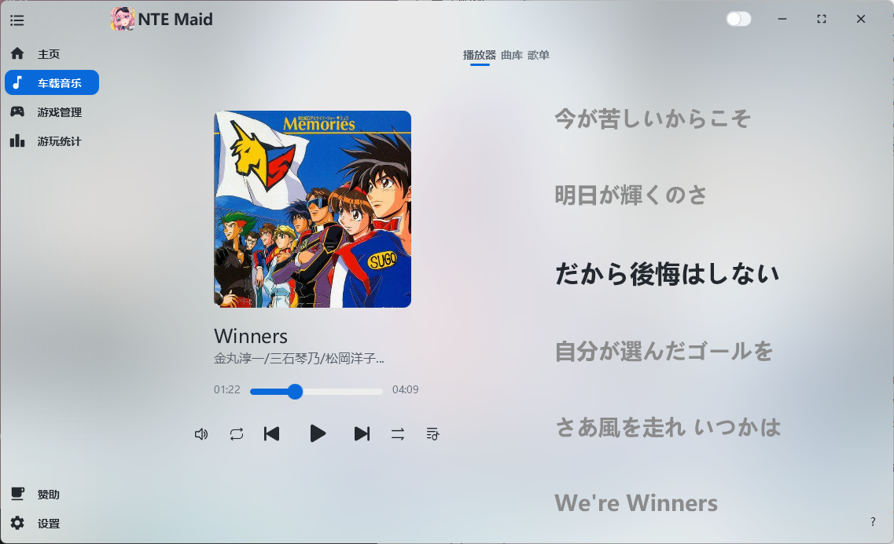

# NTE Maid
### 一款服务于异环(Neverness to Everness)的工具，支持国服国际服。

*因为异环的车载音乐有所欠缺，遂开发本程序，解决大世界开车时的听歌需求*

[点此下载程序](https://github.com/leck995/NTE-Maid/releases)

## 特色
___

1. 游戏时长统计，程序运行时，可统计每日游玩时长与总时长。*（推荐)*。
2. 更好的车载音乐，替代游戏内播放器，支持开车自动播放，下车自动暂停；支持游戏时快捷键控制（*需要管理员权限*）。

## 部分截图

## 其他
#### 1. 由于异环限制，目前无法直接通过游戏本体启动游戏，只能通过官方启动器启动。为减少启动游戏步骤，可在本程序设置中启用静默启动与自动启动游戏功能。
#### 2. 本程序的音乐功能支持游戏内快捷键功能，该功能需要授予程序管理员权限。

## 感谢与支持
***
* [OpenJFX](https://openjfx.io/) - JavaFX 框架
* [Controlsfx](https://github.com/controlsfx/controlsfx) - JavaFX 控件扩展库
* [MvvmFX](https://github.com/sialcasa/mvvmFX) - JavaFX MVVM 框架
* [JNativeHook](https://github.com/kwhat/jnativehook) - 全局键盘/鼠标监听
* [Thumbnailator](https://github.com/coobird/thumbnailator) - 图片缩略图处理
* [Jackson](https://github.com/FasterXML/jackson) - JSON 序列化/反序列化
* [JNA](https://github.com/java-native-access/jna) - Java 本地方法调用
* [AtlantaFX](https://github.com/mkpaz/atlantafx) - JavaFX 现代主题
* [Ikonli](https://github.com/kordamp/ikonli) - 图标库
* [SQLite-JDBC](https://github.com/xerial/sqlite-jdbc) - SQLite ~~JDBC 驱动~~
* [HikariCP](https://github.com/brettwooldridge/HikariCP) - 数据库连接池
* [Logback](https://github.com/qos-ch/logback) + [Log4j2](https://github.com/apache/logging-log4j2) + [SLF4J](https://github.com/qos-ch/slf4j) - 日志系统
* [Apache Commons Codec](https://github.com/apache/commons-codec) - 加密/编码工具
* [Apache Commons DbUtils](https://github.com/apache/commons-dbutils) - JDBC 工具库
* [JAudiotagger](https://github.com/jaudiotagger/jaudiotagger) - 音频元数据处理
* [Filters](https://github.com/johannburkard/filters) (JH Labs) - 图像滤镜
* [JUnit](https://github.com/junit-team/junit5) - 单元测试框架
* [Collapse](https://github.com/CollapseLauncher/Collapse) - UI参考
### 赞助
倘若喜欢本程序，欢迎支持一下开发者，您的支持会加快软件的开发进度。

您可以按以下格式留言：[名称]:[想说的话]

