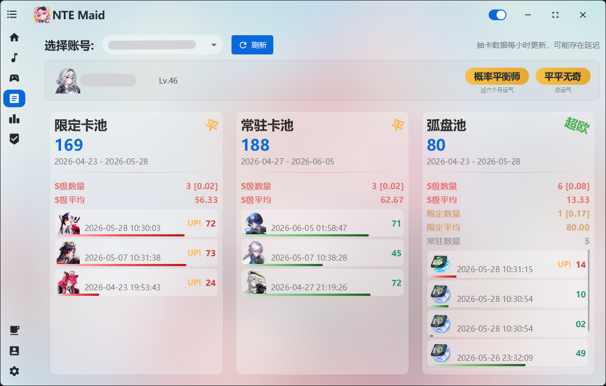

# 🛠️ NTE Maid
### 一款服务于《异环》(Neverness to Everness) 的全能助手。

**支持区服：** 国服 / 国际服  
**核心优势：** 无侵入式代码，不修改游戏数据，安全可靠。

> **开发初衷：** 86下山了，没有专属BGM总觉得少了些什么。

---

## 🚀 核心特色
* **📊 抽卡分析** — 支持查看抽卡记录（只支持国内官服）
* **⏱️ 游戏时长统计** — 程序运行期间，精准记录每日游玩时长及累计总时长，助你掌控游戏人生。
* **🎵 极致车载音乐体验**
    * **智能联动：** 完美替代游戏原装播放器，支持**上车自动播放、下车自动暂停**。
    * **快捷控制：** 支持全局快捷键，游戏过程中无需切屏即可自由切歌（*需管理员权限*）。
* **📋 塔吉多签到** — 支持塔吉多签到，蚊子腿也不放过
* **🎮 游戏操作优化** — 采用完全无侵入的方式优化游戏体验，减少繁琐操作，如钓鱼优化、探索指南优化（直接切换到每日奖励）

---

## 📸 界面预览

---

## ⚙️ 使用须知
1.  **启动说明：** 受限于游戏机制，目前无法绕过官方启动器。建议在程序设置中开启 **[静默启动]** 与 **[自动启动游戏]** 选项，一键直达大世界。
2.  **权限要求：** 若需使用游戏内快捷键控制音乐，请务必以 **管理员身份** 运行本程序。

---

## 🔗 下载与交流
* **官方发布页：** [GitHub Releases](https://github.com/leck995/NTE-Maid/releases)
* **交流 QQ 群：** `1102349327` (下载缓慢或有疑问请进群)

---

## 💰 赞助支持
如果您觉得本程序有所帮助，欢迎赞助开发者，您的支持将促进程序的持续维护！

**留言格式：** `NTEMaid [名称]:[想说的话]`

---

## ❤️ 感谢与技术栈支持
本程序的诞生离不开以下开源项目的支持：

* [OpenJFX](https://openjfx.io/) - JavaFX 框架
* [Controlsfx](https://github.com/controlsfx/controlsfx) - JavaFX 控件扩展库
* [MvvmFX](https://github.com/sialcasa/mvvmFX) - JavaFX MVVM 框架
* [JNativeHook](https://github.com/kwhat/jnativehook) - 全局键盘/鼠标监听
* [Thumbnailator](https://github.com/coobird/thumbnailator) - 图片缩略图处理
* [Jackson](https://github.com/FasterXML/jackson) - JSON 序列化/反序列化
* [JNA](https://github.com/java-native-access/jna) - Java 本地方法调用
* [AtlantaFX](https://github.com/mkpaz/atlantafx) - JavaFX 现代主题
* [Ikonli](https://github.com/kordamp/ikonli) - 图标库
* [SQLite-JDBC](https://github.com/xerial/sqlite-jdbc) - SQLite ~~JDBC 驱动~~
* [HikariCP](https://github.com/brettwooldridge/HikariCP) - 数据库连接池
* [Logback](https://github.com/qos-ch/logback) + [Log4j2](https://github.com/apache/logging-log4j2) + [SLF4J](https://github.com/qos-ch/slf4j) - 日志系统
* [Apache Commons Codec](https://github.com/apache/commons-codec) - 加密/编码工具
* [Apache Commons DbUtils](https://github.com/apache/commons-dbutils) - JDBC 工具库
* [JAudiotagger](https://github.com/jaudiotagger/jaudiotagger) - 音频元数据处理
* [Filters](https://github.com/johannburkard/filters) (JH Labs) - 图像滤镜
* [JUnit](https://github.com/junit-team/junit5) - 单元测试框架
* [Collapse](https://github.com/CollapseLauncher/Collapse) - UI参考
